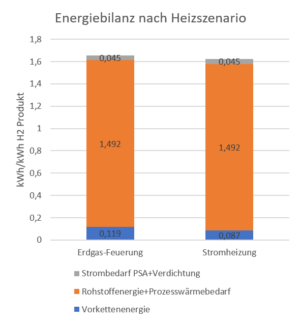
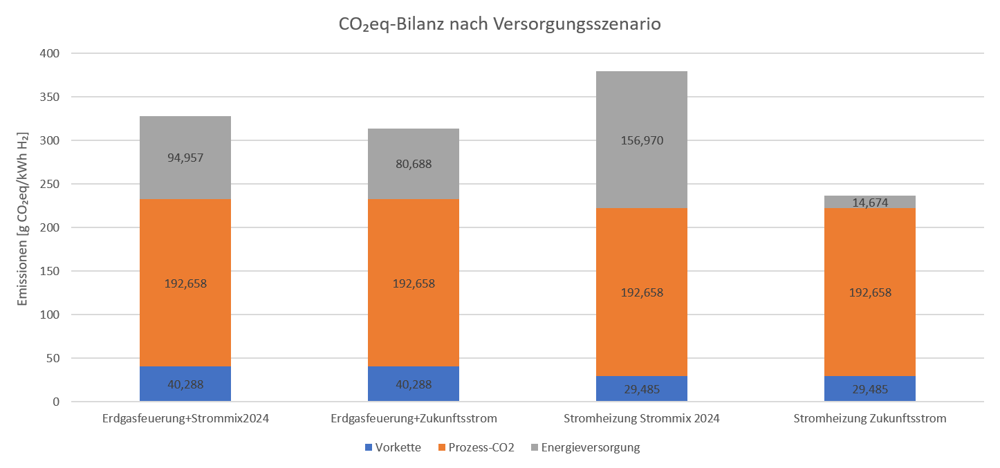

# Vereinfachte SMR-Prozesskette für Wasserstoff: Energie- und CO2(e)-Bilanz

## Worum geht es?

In diesem Projekt habe ich ein vereinfachtes Excel-Modell für die Wasserstofferzeugung aus Erdgas aufgebaut.

（Das Excel-Modell kann über `View raw` heruntergeladen und lokal geöffnet werden.）

Betrachtet wird eine Prozesskette aus:

```text
Erdgas / CH4
→ Entschwefelung und Vorwärmung
→ Steam Methane Reforming (SMR)
→ Water-Gas-Shift-Reaktion (WGS)
→ PSA-Reinigung
→ Verdichtung des H2-Produkts
```

Ziel ist nicht die genaue Auslegung einer Industrieanlage, sondern eine überschlägige technische Bilanz:

* Wie viel H2 entsteht aus einer bestimmten Menge CH4?
* Wie groß ist der Wärmebedarf im SMR/WGS-Teil?
* Wie groß ist der Strombedarf für PSA und Verdichtung?
* Wie ändern sich die CO2(e)-Emissionen bei verschiedenen Energieversorgungsszenarien?

## Aufbau der Excel-Datei

Die Excel-Datei ist in mehrere Tabellenblätter aufgeteilt.

### 1. Eingabe

In diesem Blatt werden die wichtigsten Annahmen gesammelt, zum Beispiel:

* 1 kg CH4 als Berechnungsbasis
* SMR-Umsatz: 90 %
* WGS-Umsatz: 99 %
* Steam-to-Carbon-Ratio: 3
* Reaktionstemperatur: 850 °C
* PSA-Recovery: 85 %
* Strommix- und Erdgas-Vorkettenfaktoren

Das Blatt dient als zentrale Stelle für die Modellparameter.

### 2. Vorkette

In diesem Blatt wird berechnet, wie viel Erdgas für die Prozesskette benötigt wird.

Unterschieden wird zwischen:

* CH4 als Rohstoff für den SMR-Prozess
* zusätzlichem CH4 als Brennstoff, falls die Prozesswärme durch Erdgasfeuerung bereitgestellt wird

Daraus werden die Vorkettenemissionen des Erdgases und der Vorkettenenergiebedarf abgeschätzt.

### 3. SMR + WGS

In diesem Blatt werden die Stoffbilanz und der Wärmebedarf des SMR/WGS-Teils berechnet.

Berechnet werden unter anderem:

* Stoffmengen von CH4, H2O, CO, CO2 und H2
* H2-Menge vor PSA
* Reaktionsenthalpie von SMR und WGS bei 850 °C
* Aufheizenergie für CH4 und H2O
* gesamter SMR/WGS-Prozesswärmebedarf

Für die temperaturabhängigen Enthalpien werden Shomate-Korrelationen verwendet.

### 4. PSA + Verdichtung

In diesem Blatt wird die H2-Reinigung und Verdichtung vereinfacht abgebildet.

Die PSA wird nicht detailliert ausgelegt. Stattdessen werden zwei Annahmen verwendet:

* PSA-H2-Recovery: 85 %
* PSA-Strombedarf: 400 kWh/t H2

Zusätzlich wird die Verdichtungsenergie vereinfacht mit einer isothermen idealen Gasrechnung abgeschätzt.

### 5. Ergebnis

Im Ergebnisblatt werden die wichtigsten Werte zusammengefasst.

Dargestellt werden:

* Energiebilanz in kWh/kWh H2
* Wirkungsgrad der vereinfachten Prozesskette
* CO2(e)-Bilanz für verschiedene Szenarien
* Diagramme zur Energie- und CO2(e)-Bilanz

## Betrachtete Szenarien

Für die CO2(e)-Bilanz werden vier Szenarien betrachtet:

1. Erdgasfeuerung + Strommix 2024
2. Erdgasfeuerung + Zukunftsstrom
3. Stromheizung + Strommix 2024
4. Stromheizung + Zukunftsstrom

Bei Erdgasfeuerung wird die SMR/WGS-Prozesswärme durch zusätzliche CH4-Verbrennung bereitgestellt.

Bei Stromheizung wird die SMR/WGS-Prozesswärme elektrisch bereitgestellt.

Der Strombedarf für PSA und Verdichtung wird in allen Szenarien berücksichtigt.

## Wichtige Annahmen

| Parameter                   |             Wert |
| --------------------------- | ---------------: |
| Berechnungsbasis            |         1 kg CH4 |
| SMR-Umsatz                  |             90 % |
| WGS-Umsatz                  |             99 % |
| Steam-to-Carbon-Ratio       |                3 |
| Reaktionstemperatur         |           850 °C |
| Entschwefelung / Vorwärmung |           350 °C |
| PSA-H2-Recovery             |             85 % |
| PSA-Strombedarf             |     400 kWh/t H2 |
| Erdgas-Vorkette             | 27 gCO2e/kWh CH4 |
| Strommix 2024               |     353 gCO2/kWh |
| Zukunftsstrom               |     33 gCO2e/kWh |
| CH4-Feuerung                | 2750 gCO2/kg CH4 |

## Zentrale Ergebnisse

Aus 1 kg CH4 entstehen im Modell nach PSA ungefähr:

```text
0,382 kg H2-Produkt
```

Der gesamte Energiebedarf liegt je nach Heizszenario ungefähr bei:

```text
1,62–1,66 kWh/kWh H2
```

Der Wirkungsgrad der vereinfachten Prozesskette liegt bei ungefähr:

```text
62 %
```

Die folgende Abbildung zeigt die Energiebilanz nach Heizszenario:



Für die CO2(e)-Bilanz wurden vier Versorgungsszenarien betrachtet:

| Szenario                       |    CO2(e)-Emissionen |
| ------------------------------ | -------------------: |
| Erdgasfeuerung + Strommix 2024 | ca. 328 gCO2e/kWh H2 |
| Erdgasfeuerung + Zukunftsstrom | ca. 314 gCO2e/kWh H2 |
| Stromheizung + Strommix 2024   | ca. 379 gCO2e/kWh H2 |
| Stromheizung + Zukunftsstrom   | ca. 237 gCO2e/kWh H2 |

Die folgende Abbildung zeigt die CO2(e)-Bilanz nach Versorgungsszenario:



Die niedrigsten Emissionen ergeben sich im Modell beim Szenario Stromheizung + Zukunftsstrom. Die höchsten Emissionen ergeben sich beim Szenario Stromheizung + Strommix 2024.

Das liegt daran, dass die elektrische Bereitstellung der Prozesswärme mit dem heutigen Strommix noch relativ CO2-intensiv ist. Bei einem sehr CO2-armen Strommix kann die elektrische Prozesswärme dagegen vorteilhaft sein.

## Vereinfachungen

Das Modell ist bewusst einfach gehalten. Folgende Punkte werden nicht detailliert modelliert:

* Dampferzeugung aus flüssigem Wasser
* Dampfdruckerhöhung
* reale Wärmeverluste
* Ofenwirkungsgrad
* detaillierte Wärmeintegration
* detailliertes PSA-Zyklusmodell
* Offgas-Nutzung
* CO2-Abscheidung
* Kostenrechnung

Wasserdampf wird im Modell als bereits bereitgestellt angenommen. H2O wird nur als Dampf von 100 °C bis 850 °C aufgeheizt.

Die PSA wird über Recovery und spezifischen Strombedarf vereinfacht modelliert. Die H2-Produktverdichtung auf 80 bar wird separat berechnet.

## Datenquellen

Die wichtigsten verwendeten Quellen sind:

* NIST Chemistry WebBook für Shomate-Korrelationen und thermodynamische Daten
* Umweltbundesamt für den deutschen Strommix
* Zukunft Gas / DBI für Erdgas-Vorkettenemissionen
* U.S. Department of Energy für die allgemeine Beschreibung des SMR-Prozesses
* Thunder Said Energy für eine vereinfachte PSA-Energieannahme
* NREL / UNECE für die Einordnung von Lebenszyklus-Emissionen erneuerbarer Stromerzeugung

## Hinweis

Dieses Projekt ist ein studentisches Excel-Modell zur technischen Übung. Die Ergebnisse sind überschlägige Modellwerte und keine industrielle Auslegung.
